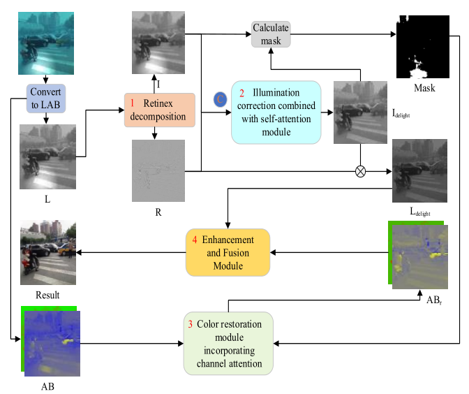

DeRetinex: 基于 Retinex 分解的水下图像增强

本项目实现了一个基于 Retinex 理论的多阶段深度学习水下图像增强框架。该框架将图像分解为光照分量（Illumination）和反射分量（Reflectance），并应用专门的模块进行光照校正、色彩恢复和细节增强。

## 项目结构

```text
├── dataloader.py    # 自定义数据集和适用于不同训练阶段的 DataLoader
├── Loss.py          # 自定义损失函数（TV、SSIM、平滑度损失等）
├── Net.py           # 网络架构（分解网络、校正网络等）
├── requirements.txt # 项目依赖项
├── train.py         # 包含 4 个独立阶段的主训练脚本
├── utils.py         # 工具函数（AL 掩码计算、物理分解等）
```

## 环境要求

- Python 3.x
- PyTorch
- torchvision
- OpenCV
- NumPy
- SciPy
- tqdm
- scikit-image

通过以下命令安装依赖：

```bash
pip install -r requirements.txt
```

## 核心模块

`Net.py` 中定义了以下核心神经网络模块：

1.  **Retinex 分解网络 (Decomposition Net)**：从图像的 L 通道（LAB 空间）中提取光照分量 ($I$) 和反射分量 ($R$)。
2.  **光照校正网络 (Illumination Correction Net)**：采用基于 Transformer 的瓶颈层（Bottleneck）来捕获全局上下文，用于校正不均匀的光照。
3.  **色彩校正网络 (Color Correction Net)**：这是一个 AL 区域自导向模块，利用通道 Transformer (Channel Transformer) 和 CBAM 注意力机制恢复水下场景的自然色彩。
4.  **细节增强网络 (Detail Enhancement Net)**：一种类似 U-Net 的架构，结合了密集块（Dense Blocks）和注意力机制来细化图像细节。
5.  **通道融合 (Channel Fusion)**：使用 FcaNet（频率通道注意力）将增强后的 L、A、B 通道融合为最终的高质量图像。

## 损失函数

为了确保高质量的图像恢复，项目使用了专门的损失函数：

- **SSIM 损失**：保持结构相似性。
- **光照平滑度损失**：一种结构感知的损失，确保光照在反射分量梯度较小的区域保持平滑。
- **色彩损失与重建损失**：最小化 LAB 色彩空间中的像素级差异。

## 训练阶段

`train.py` 中的训练过程分为四个阶段：

- **阶段 1 (train_1)**：训练分解网络，将光照和反射分量分离。
- **阶段 2 (train_2)**：利用有光/无光的成对数据训练光照校正模块。
- **阶段 3 (train_3)**：训练带有 AL 区域自导向的色彩校正模块。
- **阶段 4 (train_4)**：训练细节增强和通道融合模块，生成最终输出。

## 使用说明

要开始训练，请在 `train.py` 中配置 `model_choose` 变量和相关路径，然后运行：

```bash
python train.py
```

- 设置 `model_choose = 1` 进行分解网络训练。
- 设置 `model_choose = 2` 进行光照校正训练。
- 设置 `model_choose = 3` 进行色彩校正训练。
- 设置 `model_choose = 4` 进行细节增强与融合训练。

## 算法流程图


